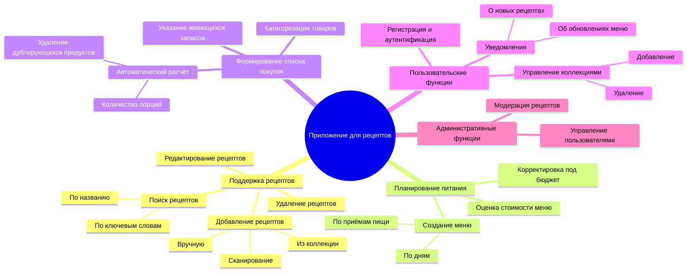

```mermaid
mindmap
  root((Приложение для рецептов))
    Поддержка рецептов
      Добавление рецептов
        Вручную
        Из коллекции
        Сканирование
      Редактирование рецептов
      Поиск рецептов
        По названию
        По ключевым словам
      Удаление рецептов
    Планирование питания
      Создание меню
        По дням
        По приёмам пищи
      Оценка стоимости меню
      Корректировка под бюджет
    Формирование списка покупок
      Автоматический расчёт
        Количество порций
        Удаление дублирующихся продуктов
      Категоризация товаров
      Указание имеющихся запасов
    Пользовательские функции
      Регистрация и аутентификация
      Управление коллекциями
        Добавление
        Удаление
      Уведомления
        О новых рецептах
        Об обновлениях меню
    Административные функции
      Модерация рецептов
      Управление пользователями
```
