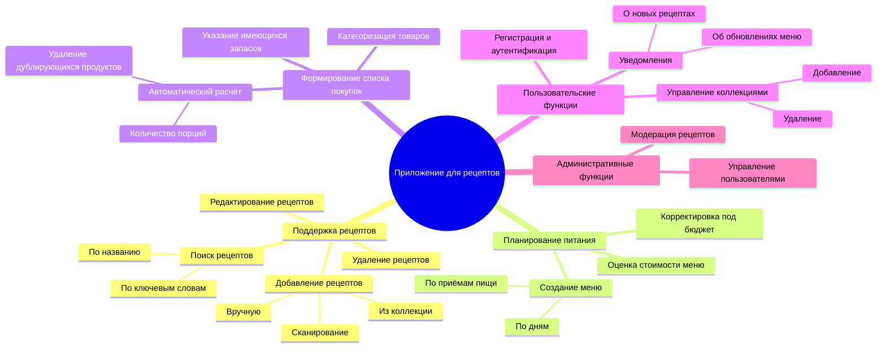
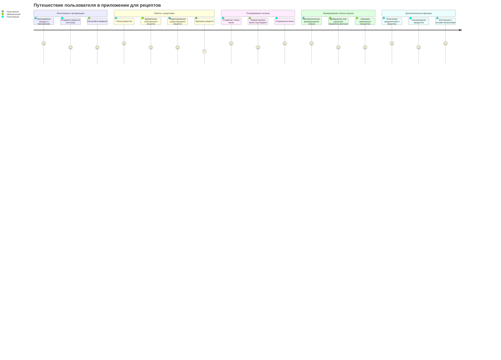
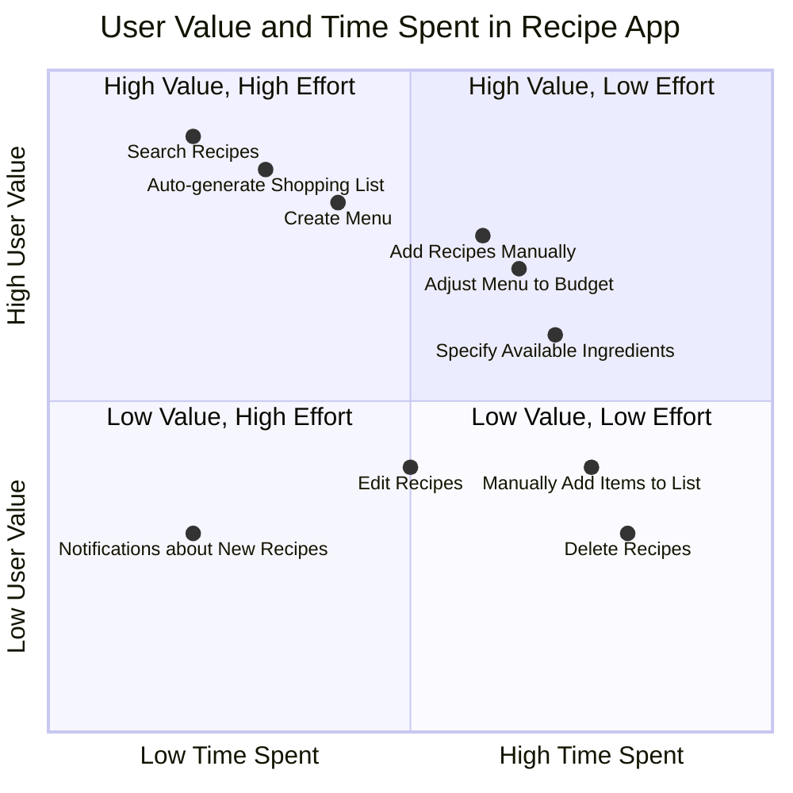
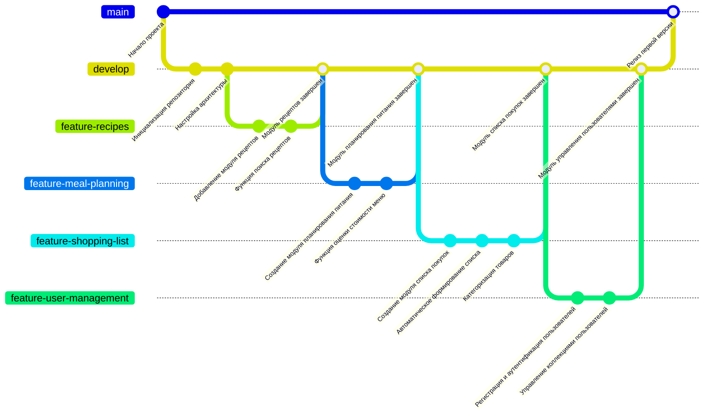

# Mind Map

Первый раздел посвящен поддержке рецептов, где пользователи могут добавлять новые рецепты вручную, из коллекции или посредством сканирования, что делает процесс максимально удобным. Также доступна возможность редактировать уже существующие рецепты, искать их по названию или ключевым словам, а при необходимости удалять. Эти функции создают основу для хранения и управления рецептами, позволяя пользователю организовывать их в соответствии со своими потребностями.

Следующий раздел охватывает планирование питания. Приложение позволяет создавать меню на определённые периоды времени, разделяя блюда по дням и типам приёмов пищи. Также предусмотрена функция оценки стоимости меню и его корректировка с учетом заданного бюджета, что делает планирование питания удобным и экономически обоснованным. Эти функции способствуют упрощению процесса планирования и делают его более структурированным.

Функционал формирования списка покупок автоматизирует расчёт необходимых продуктов, учитывая количество порций и устраняя дублирующиеся позиции. Приложение также помогает категоризировать товары и учитывать уже имеющиеся запасы продуктов, оптимизируя процесс составления списка и последующих покупок. Это значительно сокращает время и усилия, требуемые для подготовки к закупке продуктов.

Для удобства пользователей предусмотрены дополнительные функции, такие как регистрация и аутентификация, управление коллекциями рецептов (с возможностью добавления и удаления) и уведомления. Последние предоставляют информацию о новых рецептах или обновлениях меню, делая взаимодействие с приложением более информативным и персонализированным.

Административные функции включают модерацию рецептов и управление пользователями. Эти возможности обеспечивают качественный контроль контента, представленного в приложении, и поддержку системы для удобства всех пользователей.

# Диаграмма путешествий пользователя

На первом этапе, посвященном регистрации и авторизации, пользователь заходит в приложение, создает учетную запись или входит в уже существующий аккаунт. Этот процесс сопровождается положительными эмоциями благодаря удобному интерфейсу и простоте настроек. После успешной авторизации пользователь переходит к работе с рецептами. Здесь он может искать рецепты с помощью ключевых слов или по названию, добавлять собственные рецепты, редактировать их и удалять. Поиск и добавление рецептов обычно вызывают положительные эмоции благодаря их простоте и интуитивности, тогда как удаление может восприниматься нейтрально или негативно, поскольку связано с потенциальной потерей данных.

Далее пользователь переходит к этапу планирования питания. Здесь предоставляется возможность создавать меню на заданный период времени, корректировать его с учетом бюджета и сохранять. Автоматизация этих процессов обеспечивает высокий уровень удобства и вызывает положительные эмоции, особенно при адаптации меню под заданные условия. Этот этап помогает пользователю эффективно организовать свое питание, что делает приложение полезным инструментом в повседневной жизни.

Следующим шагом является формирование списка покупок, который автоматически генерируется на основе ранее созданного меню. Пользователи высоко оценивают эту функцию за ее скорость и точность. Также доступно ручное добавление или удаление продуктов, а также учет имеющихся запасов, что добавляет гибкости. Общий опыт на данном этапе оценивается положительно.

# Квадрант-граф

Квадрант-граф визуализирует ключевые функции приложения для управления рецептами, планирования питания и формирования списка покупок, распределяя их по осям пользовательской ценности и затрат времени. По оси X откладываются затраты времени, где слева находятся задачи с минимальным временем выполнения, а справа — более трудоемкие. Ось Y отображает пользовательскую ценность функций: в нижней части диаграммы расположены менее значимые возможности, а в верхней — наиболее полезные и важные для пользователей.

Первый квадрант включает функции с высокой пользовательской ценностью и низкими затратами времени, такие как поиск рецептов, автоматическое формирование списка покупок и создание меню. Эти функции предоставляют пользователям максимальное удобство и эффективность, делая их ключевыми элементами приложения. Второй квадрант содержит задачи с высокой пользовательской ценностью, но требующие значительных временных затрат, включая добавление рецептов вручную, корректировку меню в соответствии с бюджетом и указание имеющихся продуктов. Несмотря на затраты времени, эти функции существенно улучшают пользовательский опыт, добавляя гибкость и персонализацию.

Третий квадрант охватывает функции с низкой пользовательской ценностью и высокими затратами времени, такие как удаление рецептов и ручное добавление товаров в список покупок. Эти возможности менее востребованы, но необходимы для поддержания гибкости приложения. Четвёртый квадрант включает функции с низкой ценностью и минимальными временными затратами, такие как редактирование рецептов и уведомления о новых рецептах. Эти задачи выполняются быстро, но их значимость для пользователей относительно невелика.

Граф позволяет оценить, какие функции приложения обеспечивают максимальную ценность и удобство, а какие требуют оптимизации. Например, возможности из первого квадранта стоит развивать и поддерживать в приоритетном порядке, тогда как функции из третьего и четвёртого квадрантов могут быть улучшены для снижения временных затрат или повышения пользовательской значимости.

# Гит граф

Git-граф отражает процесс разработки приложения, показывая основные ветки, этапы работы и ключевые моменты интеграции. Основной структурой разработки являются две главные ветки: main и develop. Ветка main предназначена для стабильной версии приложения, доступной пользователям, а develop служит для интеграции новых функций и подготовки к релизам.

Процесс начинается с инициализации репозитория и настройки архитектуры в ветке develop. Это позволяет заложить основу для разработки приложения. Затем создаются функциональные ветки, каждая из которых посвящена отдельному модулю. Например, ветка feature-recipes фокусируется на добавлении функционала для работы с рецептами, включая их поиск, добавление и редактирование. После завершения разработки функции эта ветка сливается с develop, чтобы пройти интеграционное тестирование и подготовиться к дальнейшей разработке.

Следующим этапом становится работа над веткой feature-meal-planning, где реализуются функции планирования питания, такие как создание меню и расчет его стоимости. Аналогично, после завершения разработки эта ветка также сливается с develop. Затем создается ветка feature-shopping-list, в которой разрабатываются автоматическое формирование списка покупок, его категоризация и учет имеющихся запасов. Завершение этого модуля позволяет добавить функционал, связанный с покупками, в общий процесс разработки.

Последним крупным этапом является ветка feature-user-management, где реализуются функции регистрации, аутентификации пользователей и управления коллекциями рецептов. Этот модуль завершает разработку ключевых функций приложения. После успешной интеграции всех модулей в ветку develop выполняется её слияние с веткой main, что фиксирует релиз стабильной версии приложения.

