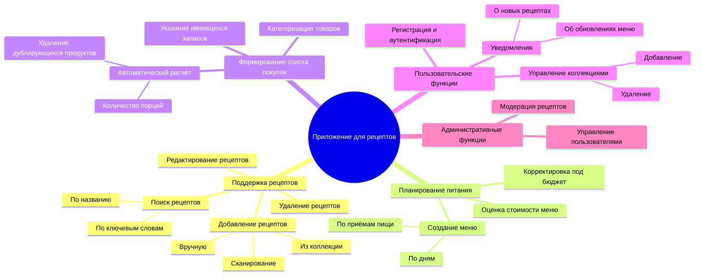
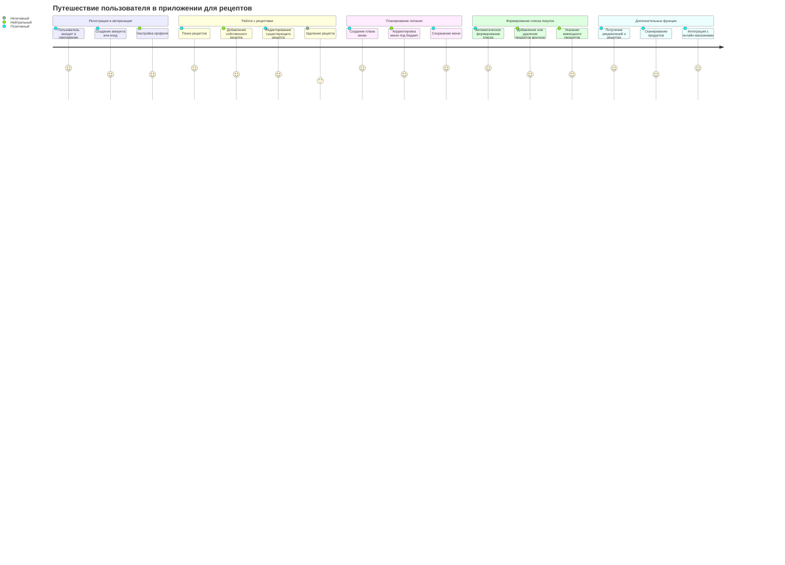
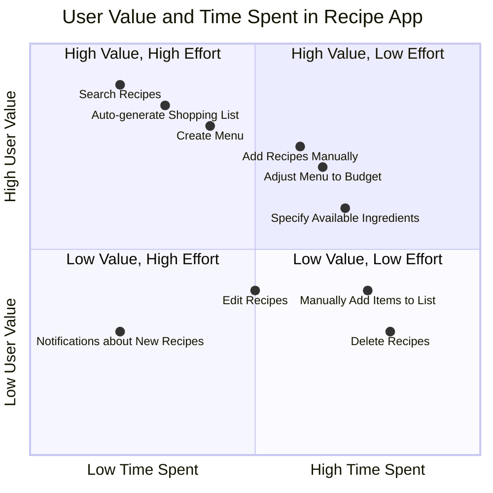
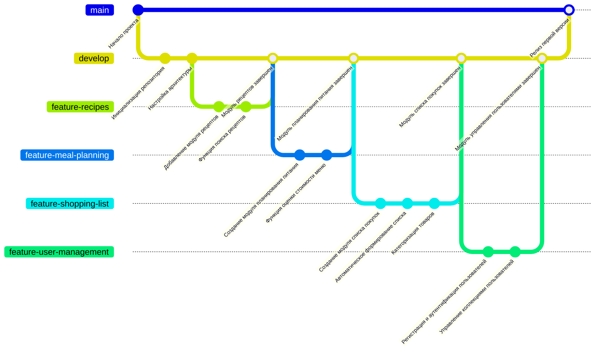

```mermaid
mindmap
  root((Приложение для рецептов))
    Поддержка рецептов
      Добавление рецептов
        Вручную
        Из коллекции
        Сканирование
      Редактирование рецептов
      Поиск рецептов
        По названию
        По ключевым словам
      Удаление рецептов
    Планирование питания
      Создание меню
        По дням
        По приёмам пищи
      Оценка стоимости меню
      Корректировка под бюджет
    Формирование списка покупок
      Автоматический расчёт
        Количество порций
        Удаление дублирующихся продуктов
      Категоризация товаров
      Указание имеющихся запасов
    Пользовательские функции
      Регистрация и аутентификация
      Управление коллекциями
        Добавление
        Удаление
      Уведомления
        О новых рецептах
        Об обновлениях меню
    Административные функции
      Модерация рецептов
      Управление пользователями
```

```mermaid
journey
    title Путешествие пользователя в приложении для рецептов
    section Регистрация и авторизация
      Пользователь заходит в приложение: 5: Позитивный
      Создание аккаунта или вход: 4: Позитивный
      Настройка профиля: 4: Нейтральный
    section Работа с рецептами
      Поиск рецептов: 5: Позитивный
      Добавление собственного рецепта: 4: Нейтральный
      Редактирование существующего рецепта: 4: Позитивный
      Удаление рецепта: 3: Негативный
    section Планирование питания
      Создание плана меню: 5: Позитивный
      Корректировка меню под бюджет: 4: Нейтральный
      Сохранение меню: 5: Позитивный
    section Формирование списка покупок
      Автоматическое формирование списка: 5: Позитивный
      Добавление или удаление продуктов вручную: 4: Нейтральный
      Указание имеющихся продуктов: 4: Нейтральный
    section Дополнительные функции
      Получение уведомлений о рецептах: 5: Позитивный
      Сканирование продуктов: 4: Позитивный
      Интеграция с онлайн-магазинами: 5: Позитивный
```

```mermaid
quadrantChart
    title User Value and Time Spent in Recipe App
    x-axis Low Time Spent --> High Time Spent
    y-axis Low User Value --> High User Value
    quadrant-1 High Value, Low Effort
    quadrant-2 High Value, High Effort
    quadrant-3 Low Value, High Effort
    quadrant-4 Low Value, Low Effort
    Search Recipes: [0.2, 0.9]
    Auto-generate Shopping List: [0.3, 0.85]
    Create Menu: [0.4, 0.8]
    Add Recipes Manually: [0.6, 0.75]
    Adjust Menu to Budget: [0.65, 0.7]
    Specify Available Ingredients: [0.7, 0.6]
    Delete Recipes: [0.8, 0.3]
    Manually Add Items to List: [0.75, 0.4]
    Edit Recipes: [0.5, 0.4]
    Notifications about New Recipes: [0.2, 0.3]
```

```mermaid
gitGraph
   commit id: "Начало проекта"
   branch develop
   checkout develop
   commit id: "Инициализация репозитория"
   commit id: "Настройка архитектуры"
   branch feature-recipes
   checkout feature-recipes
   commit id: "Добавление модуля рецептов"
   commit id: "Функция поиска рецептов"
   checkout develop
   merge feature-recipes id: "Модуль рецептов завершен"
   branch feature-meal-planning
   checkout feature-meal-planning
   commit id: "Создание модуля планирования питания"
   commit id: "Функция оценки стоимости меню"
   checkout develop
   merge feature-meal-planning id: "Модуль планирования питания завершен"
   branch feature-shopping-list
   checkout feature-shopping-list
   commit id: "Создание модуля списка покупок"
   commit id: "Автоматическое формирование списка"
   commit id: "Категоризация товаров"
   checkout develop
   merge feature-shopping-list id: "Модуль списка покупок завершен"
   branch feature-user-management
   checkout feature-user-management
   commit id: "Регистрация и аутентификация пользователей"
   commit id: "Управление коллекциями пользователей"
   checkout develop
   merge feature-user-management id: "Модуль управления пользователями завершен"
   checkout main
   merge develop id: "Релиз первой версии"
```

